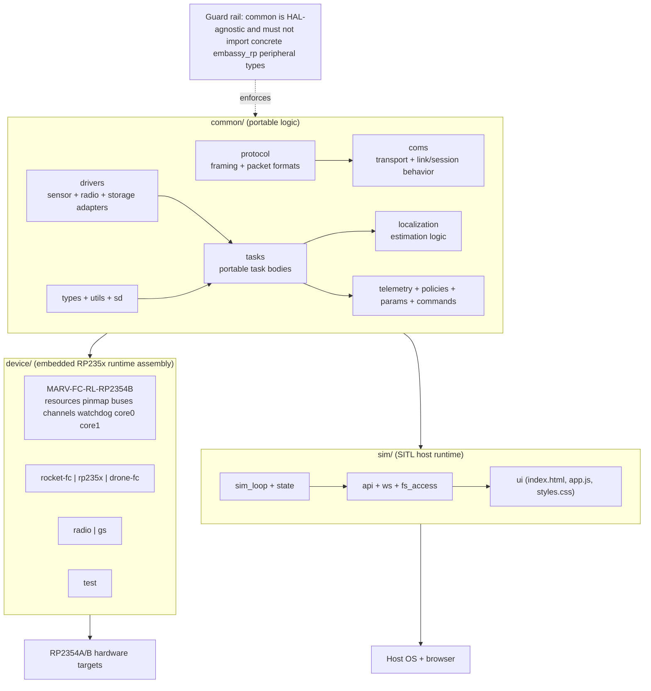
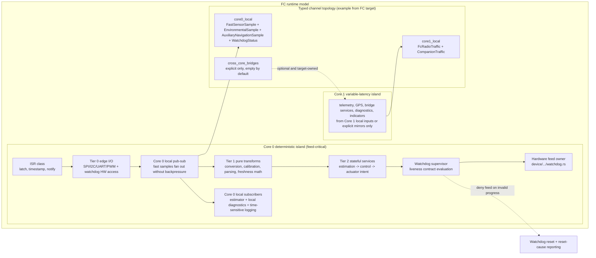
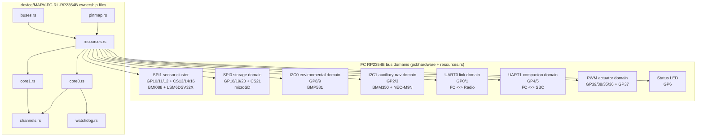

# 10. Architecture and Abstractions Visualization (Mermaid)

This page turns the architecture docs plus current workspace structure into visual Mermaid maps.

It intentionally combines:

- conceptual boundaries from `01` to `09`
- concrete workspace crates and target files
- FC hardware domains from `pcbhardware.md`

---

## 10.1 Workspace architecture and abstraction boundaries

---

## 10.2 Runtime behavior: tiers, tasks, cores, and watchdog contract

---

## 10.3 FC hardware domains and ownership wiring

---

## 10.4 Notes

- Tasks are scheduling boundaries, not architecture layers.
- `common/` owns reusable logic; `device/` owns concrete HAL assembly; `sim/` preserves parity on host.
- Watchdog feed authority should stay centralized under Core 0 supervisory logic.
- Pub-sub fan-out is core-local by default; cross-core visibility requires an explicit target-owned bridge.
- Time-sensitive logging capture belongs with the publishers on Core 0; slow sinks still require buffering and must not stall the fast path.
