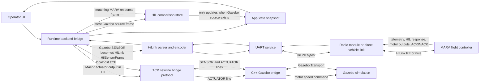

# Cerberus HIL and Field Architecture

This document defines the high-level behavior Cerberus should preserve while the backend protocol, bridge logic, and UI evolve. The main design rule is that Cerberus should not need separate user-facing operation modes for HIL, field operation, and field programming. The active data path determines what the app can show and do.

## Operating Model

Cerberus is the desktop control, translation, and inspection app between MARV, Gazebo, and the operator.

In HIL operation, Gazebo is the source of simulated sensor truth. A C++ Gazebo bridge speaks Gazebo Transport on one side and a TCP bridge protocol on the other. The Rust backend connects to that TCP bridge, decodes Gazebo sensor frames, encodes them as HiLink HIL sensor frames, and forwards them to MARV over UART. MARV runs its flight algorithms against that data and returns HiLink telemetry, HIL responses, motor outputs, acknowledgements, and other state. Cerberus keeps the Gazebo source frame and the MARV response frame together so the HIL UI can compare what went in with what MARV produced.

In field operation, the Rust backend connects over UART to the radio module or direct vehicle link that emits HiLink. The Gazebo TCP path is inactive, so there is no Gazebo source frame to retain and no HIL comparison frame to update. Normal HiLink telemetry, command, acknowledgement, diagnostics, and serial-monitor behavior still work.

Field programming should not be a separate Cerberus operation model. It uses the same UART path as field operation, and the higher-speed connection distinction is not enough to justify a separate UI mode or branch in backend behavior. Baud rate is a connection setting, not an application mode.

## Data-Path Diagram

## Runtime Rules

The UART path is always the HiLink path. Commands, telemetry, ACK/NACK tracking, serial monitoring, and parser diagnostics should work from the same backend services whether Cerberus is connected to MARV through a radio module, a direct wire, or a bench setup.

The Gazebo path is optional. When the Gazebo TCP bridge is connected and sensor frames are arriving, Cerberus treats Gazebo as the HIL data source, forwards source frames to MARV as `HilSensorFrame` messages, and accepts MARV actuator output for forwarding back to Gazebo.

HIL comparison is data-driven. The HIL tab should update when Cerberus has both a Gazebo source frame and a MARV response frame for the relevant simulation stamp. When no Gazebo source frame exists, the comparison model remains idle without requiring a field-mode branch.

The UI should expose connection state, data freshness, and protocol health instead of asking the operator to choose an application mode. A Gazebo connection panel can show whether HIL data is active, but that is different from a global mode switch.

## Protocol Surface

The Gazebo bridge protocol is currently newline-delimited TCP text. `SENSOR` lines flow from the C++ bridge to the Rust backend and include `seq`, `sim_time_us`, `clock`, accelerometer values, gyro values, orientation fields, magnetometer values, barometer pressure and altitude, temperature, GPS latitude/longitude/altitude, NED velocity, satellite count, and fix type. `ACTUATOR` lines flow from Rust to the C++ bridge and include `seq`, optional `sim_time_us`, and four motor values.

HiLink is the UART protocol between Cerberus and MARV. The Rust backend encodes outgoing commands and decodes incoming frames using protocol version 1, a fixed header, COBS framing with `0x00` delimiters, payload length checks, and CRC validation.

HiLink command messages include `Ping`, `Arm`, `Disarm`, `Rtl`, `ControlWaypoint`, `MissionWaypoint`, `CvWaypoint`, `TofWaypoint`, `BenchEnable`, `BenchDisable`, `MotorTest`, `MotorSweep`, `MotorStop`, `DshotCommand`, `ActuatorStatusRequest`, and `HilSensorFrame`.

HiLink inbound messages include `Pong`, `Ack`, `Nack`, `Heartbeat`, `HilReady`, `HilResponseFrame`, `Imu`, `Mag`, `Baro`, `Gps`, `Battery`, `SystemState`, `MotorState`, `EstimatorState`, `RadioStatus`, `TelemetrySnapshot`, and `ActuatorStatus`.

Simulation stamps are the common clock for HIL behavior. Gazebo `seq` and `sim_time_us` become the HiLink `sim_tick` and `sim_time_us` on HIL sensor frames, and MARV response frames should use those stamps so Cerberus can align source, response, actuator output, and UI comparison state.

## Backend Responsibilities

The Gazebo bridge client owns the TCP connection to the C++ bridge, parses incoming `SENSOR` lines, tracks connection statistics, and sends `ACTUATOR` lines when MARV produces HIL actuator output.

The UART service owns serial-port discovery, open/close state, baud rate, reads, writes, and transport errors. It should not know whether the bytes came from a real vehicle, a radio module, or a HIL bench.

The HiLink parser and encoder own frame boundaries, validation, typed message decoding, command encoding, telemetry field extraction, pending command events, and actuator commands decoded from `HilResponseFrame`.

The app bridge coordinates paths. It moves bytes between services, updates `AppState`, tracks pending commands, appends serial-monitor output, and populates the HIL comparison model when the Gazebo path provides source frames.

The frontend renders state and sends user intent back to the bridge. It should not contain protocol branching beyond enabling or disabling controls based on connection readiness and supported protocol capabilities.

## UI Feature Set

### Connection and Source Awareness

- The UI should show the UART link as the primary vehicle link, including selected port, baud rate, open/closed state, line coding, and the latest transport error.
- The UI should show the Gazebo bridge as an optional HIL source, including endpoint, connection state, uptime, received sensor-frame count, sent actuator-frame count, latest sequence, latest simulation time, and latest bridge error.
- The UI should infer HIL activity from live Gazebo source frames instead of asking the operator to select a HIL mode.
- The UI should treat baud rate as a UART connection setting, not as a field programming mode.

### Live Telemetry

- The UI should present parsed HiLink telemetry grouped by protocol, timing, sensors, navigation, system, actuators, and commands.
- The UI should show message freshness using the latest HiLink direction, message type, sequence, send time, payload length, RX frame count, TX frame count, and parse error count.
- The UI should support a concise telemetry workspace that lets operators pin or compare important fields without duplicating the same raw data in every tab.
- The UI should expose GPS, IMU, magnetometer, barometer, estimator, motor, battery, radio, heartbeat, system state, and telemetry snapshot values because those are present in the HiLink parser surface.

### HIL Comparison

- The HIL UI should compare the Gazebo source frame sent to MARV with the MARV response frame returned for the same simulation tick or simulation time.
- The HIL UI should show source sensor data, MARV-estimated state, MARV motor outputs, and timing alignment in one compact comparison view.
- The HIL UI should stay empty or show an inactive-source state during field operation because no Gazebo source frame exists.
- The HIL UI should make actuator feedback visible by showing when MARV motor output is forwarded back to Gazebo as an `ACTUATOR` command.

### Commands and Acknowledgements

- The UI should provide command controls for HiLink messages that Cerberus can encode, including ping, arm, disarm, RTL, waypoint commands, HIL sensor-frame injection, and actuator-status requests.
- The UI should show pending command status by sequence and message type, then resolve commands with `Pong`, `Ack`, or `Nack` events when MARV responds.
- The UI should display acknowledgement counts, rejection counts, the latest command event, and a short pending-command history so operators can see whether commands are accepted or rejected.
- The UI should use the latest Gazebo simulation stamp for HIL-related commands when available and fall back to app elapsed time when Gazebo is inactive.

### Bench and Actuator Tools

- The UI should expose bench enable, bench disable, motor test, motor sweep, motor stop, DShot command, and actuator-status request as a focused actuator tools area.
- The UI should make motor mask, motor mode, command value, duration, ramp, sweep range, repeat count, and DShot command code explicit because they are fields in the HiLink command payloads.
- The UI should separate high-risk actuator controls from routine telemetry controls and make the current actuator status visible near those controls.
- The UI should show actuator status fields such as bench armed, bench enabled, active motor mask, commanded DShot values, command age, timeout, and actuator flags.

### Protocol Diagnostics

- The UI should include a serial monitor that can switch between raw UART bytes and parsed HiLink frame summaries.
- The UI should report parser failures, CRC failures, delimiter problems, unsupported protocol versions, unknown message types, and payload-length errors through the protocol diagnostics surface.
- The UI should make RX and TX direction visible for every decoded frame so operators can understand whether Cerberus or MARV produced the message.
- The UI should keep protocol details available without making them the primary workflow for normal mission and field operation.

### Mission Inputs

- The UI should support global control and mission waypoints using latitude, longitude, altitude MSL, yaw, and reference simulation stamps.
- The UI should support CV waypoints using a body-frame direction vector and confidence value.
- The UI should support ToF waypoints using distance, bearing, elevation, and reference simulation stamps.
- The UI should keep mission-command forms close to live acknowledgement and telemetry feedback so operators can see command effects without switching contexts.

## Change Guidance

Future backend changes should remove global behavior branches that exist only to distinguish HIL operation from field operation. The durable distinction is whether the Gazebo path is producing source frames.

Future UI changes should avoid adding another mode switch for field programming. Field programming, field operation, and direct UART bench work are all UART-backed HiLink workflows.

Future protocol additions should be reflected in three places: the typed HiLink parser/encoder, the app-state fields exposed to the frontend, and this architecture document's feature set.
